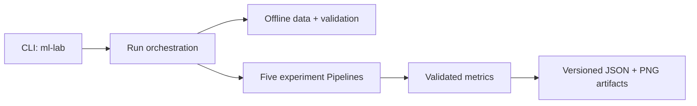

# classical-ml-lab

> Reproducible, production-minded experiments for Decision Trees, Random Forests, AdaBoost, SVM, and Logistic Regression. Built for learning and engineering review—not for real credit or medical decisions.

一个可复现的经典机器学习实验室：用五个小而完整的实验展示可信的数据处理、模型训练、调参、评估和可审计产物。

本项目是已归档的 [`machinelearning-blob`](https://github.com/silasxlx/machinelearning-blob) 教学示例的重新设计版本。

## 是什么、为什么、怎么用

| 问题 | 回答 |
| --- | --- |
| **是什么？** | 一个围绕决策树、随机森林、AdaBoost、SVM 和逻辑回归的统一 Python 包与 CLI。 |
| **为什么？** | 把容易“跑出一个分数”的旧 Notebook，升级为路径无关、评估可信、依赖可复现、结果可审计的工程项目。 |
| **怎么用？** | 安装 `uv` 后执行下面三条命令，默认数据全部离线可用。 |

> [!IMPORTANT]
> 本项目仅用于教学和工程演示。默认数据是 scikit-learn 内置数据或本地生成的合成数据。模型不得直接用于真实授信、医疗诊断或其他高风险决策。

## Quick Start

前置条件：[Git](https://git-scm.com/) 与 [uv](https://docs.astral.sh/uv/)；Python 和项目依赖由 `uv` 管理。

<!-- quickstart:start -->
```bash
git clone https://github.com/silasxlx/classical-ml-lab.git
cd classical-ml-lab
uv run ml-lab run all
```
<!-- quickstart:end -->

第三条命令会自动创建环境、安装锁定依赖并在 `artifacts/<run-id>/` 下生成五个实验的指标和图表。

查看或单独运行实验：

```bash
uv run ml-lab list
uv run ml-lab run svm --seed 42
uv run ml-lab run random-forest --seed 42
uv run ml-lab run logistic-regression --seed 42
```

## 五个实验

| 实验 | 默认数据 | 关键工程点 | 主要产物 |
| --- | --- | --- | --- |
| Decision Tree | Iris | 固定划分、无需 Graphviz、现代 `plot_tree` | 多分类指标、树图 |
| Random Forest | 本地生成的不平衡数据 | 插补置于 Pipeline、训练集内分层 CV | 二分类指标、CV 摘要、特征重要性 |
| AdaBoost | Breast Cancer Wisconsin | 当前 `estimator` API、独立测试集 | 二分类指标、特征重要性 |
| SVM | Iris 二分类子集 | `StandardScaler + SVC` Pipeline | 二分类指标、决策边界 |
| Logistic Regression | 本地生成的不平衡数据 | `Imputer + Scaler + LogisticRegression`、训练集内分层 CV | 二分类指标、CV 摘要、标准化系数图 |

二分类实验报告 accuracy、balanced accuracy、precision、recall、F1、ROC-AUC、PR-AUC 和混淆矩阵。Iris 多分类实验同时报告 macro/weighted 指标和 OvR AUC。

## 输出与可审计性

```text
artifacts/<run-id>/
├── run.json
└── experiments/
    ├── decision-tree/
    │   ├── metrics.json
    │   └── figures/tree.png
    ├── random-forest/
    ├── adaboost/
    ├── svm/
    └── logistic-regression/
```

- `run.json` 记录 seed、配置哈希、依赖版本、运行状态和相对产物路径。
- `metrics.json` 记录数据来源/指纹、训练测试划分、模型配置、指标、混淆矩阵和 CV 摘要。
- 重复执行不会静默覆盖旧产物。
- 相同数据、配置、依赖与 seed 的指标在同一环境中可复现。

JSON Schema 位于 [`schemas/`](schemas/)，公共接口见 [`docs/api.md`](docs/api.md)。

## 架构



核心代码位于 `src/classical_ml_lab`：

- `data.py`：内置/合成数据及可选信用 CSV 校验。
- `metrics.py`：统一二分类与多分类指标。
- `experiments/`：每个算法的训练、评估和图表。
- `runner.py`、`artifacts.py`：运行编排、哈希、防覆盖和审计产物。
- `cli.py`：稳定的命令、参数与退出码。

架构、数据边界和评估设计见 [`docs/design.md`](docs/design.md)。

## 使用本地信用数据（可选）

大型原始信用数据不进入仓库，也不会被自动下载。Random Forest 与 Logistic Regression 共用同一套本地数据校验；只有在你已合法取得数据并接受其来源条款时，才可显式传入本地文件：

```bash
uv run ml-lab run logistic-regression \
  --dataset credit \
  --data-path data/raw/cs-training.csv
```

加载器会在训练前校验字段、目标、类型、样本数和类别分布。详细说明见 [`docs/design.md`](docs/design.md)。即使使用该数据，结果仍然只是教学实验，不能作为真实授信决策依据。

## 开发与质量

```bash
uv sync --locked --all-extras
uv run ruff check .
uv run mypy src
uv run pytest --cov=classical_ml_lab --cov-branch --cov-fail-under=85
```

CI 覆盖 Python 3.11–3.13、Ubuntu 和 Windows，并执行 lint、类型检查、测试、Notebook smoke test 与安全扫描。核心逻辑覆盖率目标为 85%，不以追求 100% 数字替代有效行为断言。

## 文档

- [公共 API 与 CLI](docs/api.md)
- [架构、数据与评估设计](docs/design.md)
- [贡献指南](CONTRIBUTING.md)
- [安全策略](SECURITY.md)
- [变更记录](CHANGELOG.md)

## 贡献

欢迎修正文档、增加边界测试、改善可解释图表或提出新的经典算法实验。请先阅读 [`CONTRIBUTING.md`](CONTRIBUTING.md)，使用 Conventional Commits，并确保 lint、类型检查和测试通过。

项目采用 [MIT License](LICENSE)。
